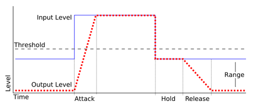
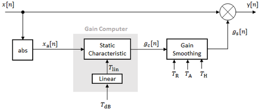
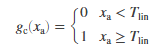
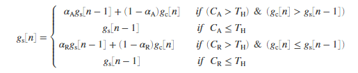
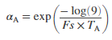
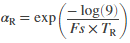
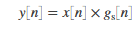
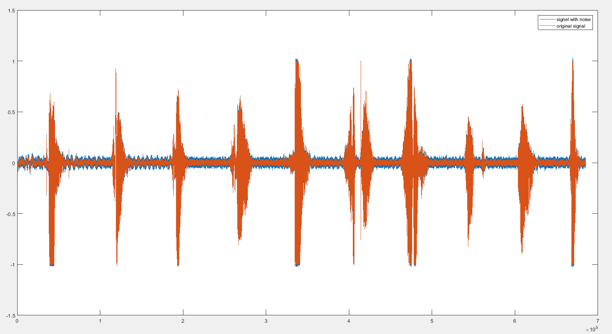
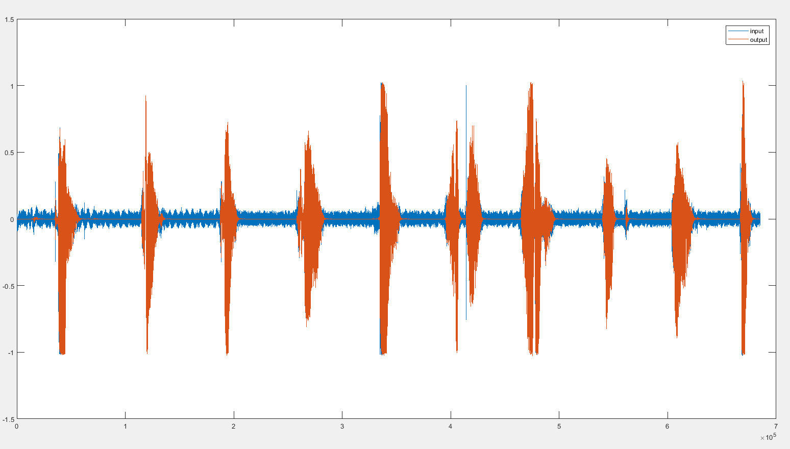
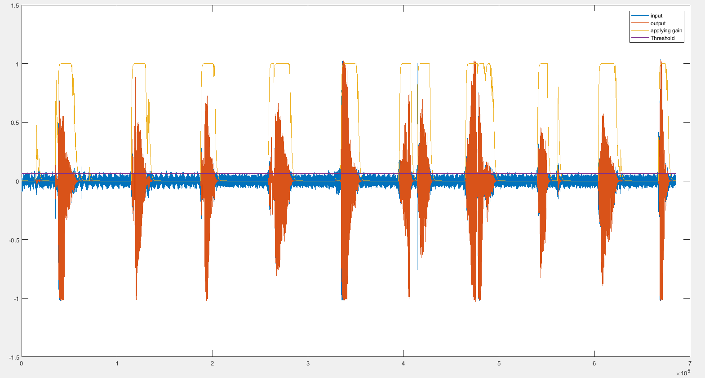

# Noise Gate User manual

V 1.0	原理及接口说明

## Noise Gate 介绍

​	Noise Gate，噪声门，常用于在音频信号处于低电平时，压制能听到而又不想要的噪声。通常可以使用它来移除背景噪音 、其他信号来源的干扰以及低电平的杂音。更为高级的用法则是用于guitar演奏中，通过主动控制Noise Gate的开关，减少拖尾，突出演奏效果。

​	Noise Gate的工作原理可以概括为“ 让临界值音量（电平）以上的信号不受碍地通过， 同时减少低于临界值音量的信号 ”， 从而有效地移除信号的较低音量声部并让所需的音频声部通过 。

###Noise Gate 参数

​	Noise Gate的结构与limiter类似，通常情况下有以下基础参数：

**Threshold：** 阈值，信号超过阈值时Noise Gate将会打开，此时信号不会受到抑制，当低于阈值时，将会视为noise进行压制，需根据实际情况进行设定。

**Release time：** 释放时间，当输入信号低于阈值后到被完全抑制的时间，即noise从完全打开到完全关闭的时间长度。当release timec很小时会导致输出信号截断，并且在gate重新打开时会听到“click”的现象，较长的release time相当于“fade out”的效果。release time的重要程度仅次于Threshold。

**Attack time：** 响应时间，当输入信号超过阈值时，noise gate从完全关闭到完全打开所需要的时间，相当于“fade in”

**Hold time：** 保持时间，在信号低于阈值时，仍然保持原有增益直到开始release的时间，为了防止noise gate在短时间内打开/关闭次数过多。

​	一些高阶Noise Gate会根据实际需求添加以下控制参数（非必要）：

**Range：** 范围，控制信号在低于Threshold时抑制信号的程度，基础的Noise Gate在信号低于阈值时会完全抑制导致静音，在某些情况下会产生很突兀的效果，使用此参数可以调节抑制的程度，避免完全静音。

**Hysteresis：** 迟滞，将单个的 **Threshold** 分成两个Threshold（lowThreshold，ultraThreshold），一个用于控制Gate open，另一个用于控制Gate close，避免Noise Gate频繁地打开/关闭。

​	以下是一个基础Noise Gate的理想表现示意图：

 

## Noise Gate结构

​	本节将介绍所使用的Noise Gate的具体设计，可以实现Noise Gate的基础参数。下图为Basic Noise Gate模型示意图：



​	如图所示，Basic Noise Gate主要由两部分组成，*Gain computer，Gain smoothing*。其中，Gain computer主要用于判别输入信号是否超过所设定的阈值，决定是否开启/关闭Noise Gate。而Gain smoothing则用于平滑最终应用于信号上的增益值，防止因Noise Gate频繁打开/关闭造成的gain突变现象。

​	具体的处理步骤如下：

1. **Gain computer**

   ​	直接与阈值对比，判断输入信号的值是否超过阈值。此方法的优势在于对于输入信号的变化特别敏感，因此适合信号变化较快的应用。

   ​	  $x[n] \rightarrow abs() \rightarrow x_{abs}[n]$ 

   

2. **Gain smoothing**

   ​	对即将应用于输出信号的增益进行平滑，直接决定最终输出信号的效果，其中attack time，release time 和 hold time的设定需要根据实际信号进行调试。

   

   

   

3. **Applying gain**

   

需要注意的地方：

​	从Gain smoothing中gs的式子可以看出，在有hold time参数的作用下，要是gca频繁地变化（对应noise gate频繁地打开、关闭），gs会一直保持原有的增益不变，避免了gs变化过快的情况发生。但是这也带来了另一个问题，gain computer中的计算计算方式导致对于在阈值附近的信号，gca会产生不必要的抖动，即从处传进来的gca会在短时间内在0/1间不断变化，引起误判，导致gs一直保持原有数值不发生变化。

​	作为修正，我们将gain computer进行改进，直接检测输入信号的包络，将此level detector改为peak envelope detector，提高对瞬态信号的抗干扰能力。具体公式如下：
$$
y_{env}[n] = \alpha_R*y_{env}[n-1]+(1-\alpha_A)*max(x_{abs}[n]-y_{env}[n-1],0)
$$
## C/C++ 实现

​	根据上节给出的结构和处理流程，接下来我们将会介绍使用C/C++实现Noise Gate的具体步骤。

**step 1. 参数设置及初始化**

```c++
noise_gate_buff NG;	// noise gate has some default value in the struct
```

​	在结构体中，存储有Noise Gate所需的控制参数及使用的buff，并使用了默认的值进行初始化，需要实际情况修改对应的参数，可以修改的参数有：fs，attack_time，release_time，hold_time以及threshold。

```c++
  struct noise_gate_buff {
        double fs = 48000;// sample rate(Hz)
        double attack_time = 0.05;// attack time(seconds)
        double release_time = 0.02;// release time(seconds)
        double hold_time = 0.0003 ;// hold time(points)
        double threshold = -24;// threshold(dB)
        
      	hold_time*=fs;
        double t_lin = pow(10, threshold / 20);
        double at = exp(-log(9) / (fs * attack_time));		// attack time smoothing coefficient
        double ar = exp(-log(9) / (fs * release_time));		// release time smoothing coefficient
    
        double counter_a = 0;// hold counter for attack time
        double counter_r = 0;// hold counter for release time
    
        //double x_abs = 0;// x_abs buff,x_abs is the current value
        double x_env = 0;
        //double gca = 0;
        double gs[2] = { 0 };
    };
```

​	

**step 2. 循环处理**

​	Noise Gate的处理过程以函数给出，并通过point-by-point的形式进行处理。输入参数为当前输入音频数据，noise_gate_buff结构体，输出参数为当前点处理后的音频数据。在循环中调用本函数即可，noiseGate函数见附录。

```c++
int main(){
    noise_gain_buff NG;
    //NG.release_time = 0.05;// set the coefficients 

    for(auto data_in:aduio_in){ // audio_in contains the audio data
        data_out = noiseGate(data_in,NG);
        // save the processed points
    }
	// ps. This is a demo to show how to use the function,if you want to run the codes in your PC,make sure you have the wav file read/write method.
    return 0;
}
```

### 参数设置参考

| 参数         | 范围     | 单位 | 默认  |
| ------------ | -------- | ---- | ----- |
| fs           | -        | hz   | 48000 |
| release_time | (0,4]    | s    | 0.2   |
| attaclk_time | (0,4]    | s    | 0.05  |
| hold_time    | (0,4]    | s    | 0.003 |
| threshold    | [-120,0] | dB   | -24   |

## 样例测试分析

​	我们使用从1数到10的录音信号（Counting-16-44p1-mono-15secs.wav）作为测试，原始信号及加入40dB底噪后的信号如下：



使用Noise gate处理前后的信号如下：



处理过程中增益的变化：




以上测试所用的文件如下：

原始信号：Counting-16-44p1-mono-15secs.wav

加噪信号：signal_with_noise.wav

NoiseGate处理后的信号：after_noise_gate.wav


